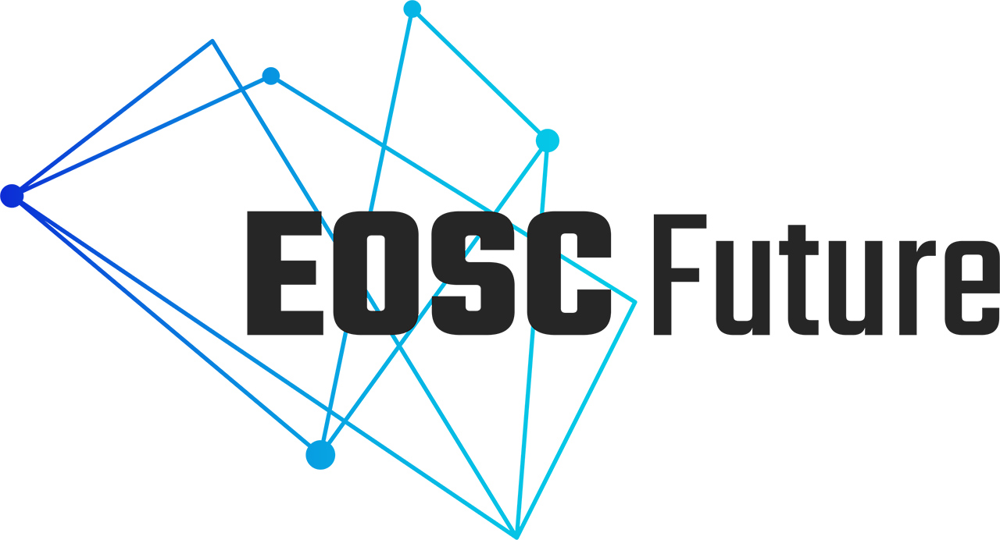
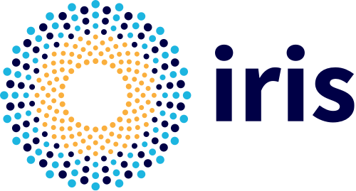

# Grid Operations Configuration Management Database

A Repository, Portal and REST style API for managing Grid and Cloud topology
objects including; projects, administrative domains, sites, services,
service-endpoints, service-groups, downtimes, users, roles and business rules.

GOCDB is provided by [STFC](https://stfc.ukri.org/), part of
[UK Research and Innovation](https://www.ukri.org/), and is co-funded by
[EGI](https://egi.eu) via [EGI-ACE](https://www.egi.eu/project/egi-ace/),
[EOSC-Future](https://eoscfuture.eu/) and the [IRIS](https://www.iris.ac.uk/)
community.

## Documentation

- [GOCDB Programmatic Interface](api/index.md)
